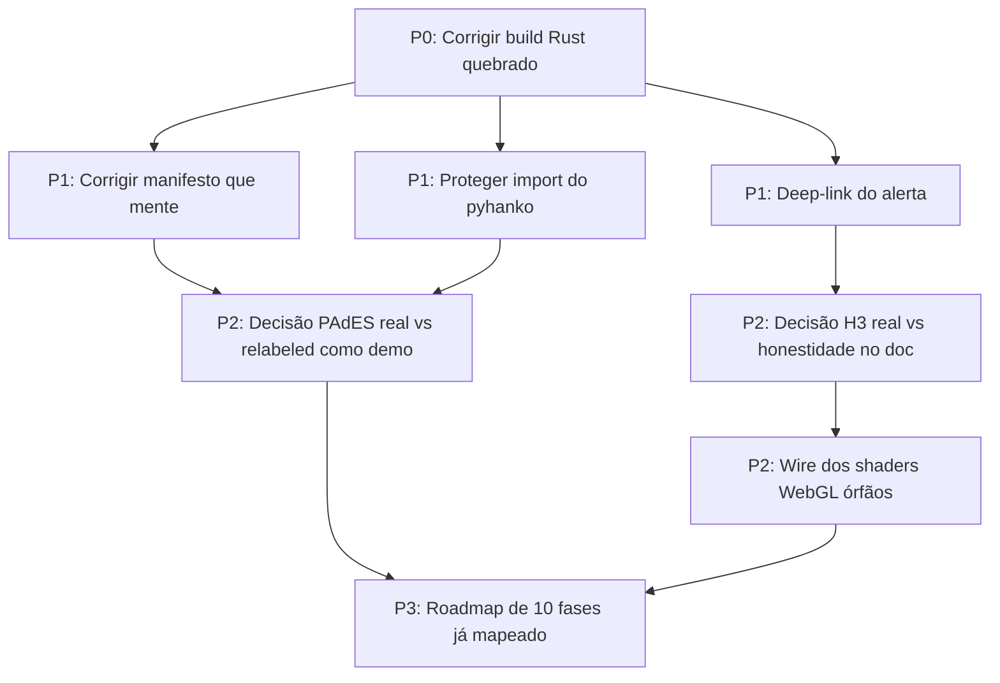

# Como Continuar o Dashboard-cam Sem Se Perder?

> [!WARNING]
> Este projeto tem um padrão **confirmado e repetido** (3 auditorias
> independentes, 2026-08-16/17/29): documentação e nomes de função descrevem
> uma arquitetura idealizada; o código real frequentemente cai em simulação
> silenciosa ou fica órfão (existe mas nunca é chamado). Ver Regra Especial 1
> no final deste arquivo antes de escrever qualquer linha de status "✅".

## Índice

| # | Seção | Status |
|:--|:------|:------:|
| 1 | Estado real por feature (tabela-mestra) | ✅ |
| 2 | Ordem de execução recomendada | ✅ |
| 3 | P0 — Build quebrado (bloqueia tudo) | ✅ |
| 4 | P1 — Fechar o que já está quase pronto | ✅ |
| 5 | P2 — Implementação real por feature (pesquisado, com fontes) | ✅ |
| 6 | Bibliotecas/serviços prontos a considerar | ✅ |
| 7 | P3 — Roadmap de longo prazo (features de verdade novas) | ✅ |
| 8 | Regras especiais pra IA neste projeto | ✅ |
| 9 | Glossário | ✅ |
| 10 | Changelog | ✅ |

---

## 1. Estado real por feature (tabela-mestra)

**Problema real:** antes de decidir o que fazer a seguir, é preciso saber
o que já é real, sem reconfiar em `PROJECT_MAP.md` ou `RELATORIO_AUDITORIA_GERAL.md`
— ambos são autocertificação sem verificação externa (achado da auditoria de
2026-08-29, ver Seção 7).

| Feature | Veredito | Evidência |
|:--------|:--------:|:----------|
| Alertas SSE → toast/histórico (`useMatchAlerts.ts`, `AlertCenter.tsx`) | ✅ REAL, 100% (2026-08-29) | Montado em `catalog/src/Layout.tsx`, payload bate com backend, deep-link fechado e verificado no browser. |
| Liveness de câmeras YouTube (`camera_liveness.py`, NOVO 2026-08-29) | ✅ REAL | 58% das 823 câmeras confirmadamente vivas numa varredura completa (yt-dlp real, client "android" pra evitar bloqueio anti-bot). Frontend nunca abre câmera confirmadamente morta. |
| Shaders WebGL (Unsharp Mask, CLAHE, FLIR) (`useWebGLVideoFilters.ts`) | 🔄 REAL, ÓRFÃO | GLSL genuíno, compila, nunca é chamado. Viewer real usa filtro CSS num iframe do YouTube. |
| Split-view antes/depois, zoom, export PNG (`ForensicPlateInspector.tsx`) | ✅ REAL | Slider `clip-path`, canvas export funcional. |
| Hash SHA-256 duplo | ✅ REAL | `forensic_sr_engine.py:395,461`, `hashlib.sha256` real sobre bytes de imagem, calculado no backend. |
| Merkle tree (`forensic_core.py`) | 🔄 REAL, USO TRIVIAL | Algoritmo correto, mas só roda uma vez sobre 2 elementos, sem cadeia de evidência real. |
| Síntese de áudio (`TacticalAudioEngine.ts`) | ✅ REAL | `AudioContext`/`OscillatorNode` reais, zero assets externos. |
| ALPR Mercosul (`forensic_sr_engine.py`) | ✅ REAL (2026-08-29) | YOLOv8n detecta bbox real + EasyOCR lê + correção posicional + valida regex Mercosul. Detector genérico, não fine-tuned em placas brasileiras reais ainda. |
| Super-resolução neural 4x | ✅ REAL (2026-08-29) | Real-ESRGAN via ONNX Runtime rodando de verdade (não Lanczos disfarçado). CodeFormer real pra rosto, `fidelity_weight` com efeito real. |
| "Face CNJ 484/2022" | 🔴 COSMÉTICO (label removido) | O rótulo fake foi removido do endpoint de enhancement. O alinhamento CNJ 484 de verdade já existe em `CNJLineupEngine` (`forensic_core.py`), separado. |
| Botão "Emitir Laudo PDF" | 🔴 FAKE (não tocado ainda) | `setTimeout` + `alert()` de sucesso. Nenhum PDF é gerado. Fora do escopo desta rodada. |
| Motor Espacial H3 (`spatial_engine.py`) | ✅ REAL (2026-08-29) | `h3.latlng_to_cell`/`grid_disk`/`polygon_to_cells` reais (API v4). Busca por raio agora usa k-ring real, não só célula exata. |
| "Generated Columns STORED" (Postgres) | 🔴 MORTO (sem mudança) | DDL correta existe como string, nunca executada contra um banco real — não fazia parte do escopo desta rodada. |
| Frustum 3D de câmera | 🔄 REAL, SIMPLIFICADO | Trigonometria genuína (tilt/FOV → footprint no chão), sem matriz de câmera real. Heading ainda é placeholder (sem sensor real disponível). |
| "Handover preditivo via LAPJV" | 🔴 FAKE (sem mudança) | Ainda é filtro por raio + ordenação, sem algoritmo de assignment. Fora do escopo desta rodada. |
| PAdES-LTA / pyHanko (`forensic_core.py`) | ✅ REAL (2026-08-29) | TSA real (DigiCert respondeu em teste), `pymerkle` real, certificado plugável, manifesto honesto sobre sucesso/falha. Achado extra: a chamada a `sign_pdf()` estava estruturalmente quebrada (nunca funcionava) — corrigida junto. Certificado continua autoassinado (não-ICP-Brasil) até o usuário obter um real. |
| `pyhanko`/`h3`/`pymerkle`/`easyocr` como dependência | ✅ RESOLVIDO | Todos declarados em `olho_de_deus/pyproject.toml` agora. |
| Build Rust/Tauri (`lib.rs`) | ✅ COMPILA (2026-08-29) | Borrow checker corrigido + ícones do app gerados (nunca existiam). `cargo check` limpo. |
| CSP restritiva + `withGlobalTauri: false` | ✅ REAL | Hardening genuíno, não cosmético. |
| `export_csv` (comando Tauri novo) | 🔴 MORTO | Nunca invocado pelo frontend — o botão real chama um endpoint HTTP separado. |
| "Zero Trust / Edge AI" (commit `07acd03`) | 🔴 MARKETING | 45 linhas de prosa em `PROJECT_MAP.md`, sustentadas por 8 linhas de `[profile.release]` no Cargo.toml. Nenhuma dependência de AI/edge foi adicionada. |
| SigLIP busca semântica | 🔴 FAKE (já sabido) | `hashlib.md5` disfarçado de embedding — mas `aprendizado.md` marca essa linha como ✅ sem ressalva, o que é uma **inconsistência de doc**, não um dado novo. |

> [!NOTE]
> Itens marcados `🔴 FAKE`/`🔴 MORTO` não são necessariamente "trabalho ruim" —
> são o roadmap de trabalho real ainda não feito. O problema é que a
> documentação atual não deixa isso claro (ver Regra Especial 1).

---

## 2. Ordem de execução recomendada



**Por quê nessa ordem:** P0 bloqueia literalmente qualquer teste do app
empacotado. P1 são consertos baratos e de alto retorno de confiança
(inclusive um problema de integridade de dado real — o manifesto forense).
P2 são decisões de produto/arquitetura que precisam ser tomadas antes de
escrever mais código em cima (não adianta "consertar" H3 sem decidir se vale
usar a lib de verdade ou só documentar como simulação intencional). P3 é o
roadmap de features genuinamente novas, já detalhado em
[`/home/douglasdsr/.claude/plans/modular-forging-kazoo.md`](/home/douglasdsr/.claude/plans/modular-forging-kazoo.md)
— não duplicado aqui.

---

## 3. P0 — Build quebrado (bloqueia tudo)

**Problema real:** `cargo check` falha, então o app Tauri não empacota.
Nenhuma verificação visual de qualquer feature de frontend é confiável até
isso ser corrigido.

**Implementado em:** [`catalog/src-tauri/src/lib.rs:308`](catalog/src-tauri/src/lib.rs)

```
error[E0716]: temporary value dropped while borrowed
   --> src/lib.rs:308:45
    let data_dir = db_p.parent().unwrap_or(&PathBuf::from("."));
```

**O que fazer:** `&PathBuf::from(".")` cria um valor temporário que morre no
fim da expressão — trocar por uma variável com lifetime próprio antes do
`unwrap_or`, ex:

```rust
let fallback = PathBuf::from(".");
let data_dir = db_p.parent().unwrap_or(&fallback);
```

**Critério de aceite:** `cd catalog/src-tauri && cargo check` sem erros
(avisos são aceitáveis). Rodar de verdade, não assumir.

---

## 4. P1 — Fechar o que já está quase pronto

### 4.1 Deep-link do alerta pra câmera certa

**Problema real:** clicar num alerta leva pra `/cameras?camera=<id>`, mas
a página ignora o parâmetro — usuário cai na grade geral, não na câmera
que disparou o alerta.

**Implementado em:** [`catalog/src/pages/CameraGrid.tsx`](catalog/src/pages/CameraGrid.tsx)
(consumidor faltante), [`catalog/src/components/AlertCenter.tsx`](catalog/src/components/AlertCenter.tsx) (já emite corretamente)

**O que fazer:** em `CameraGrid.tsx`, ler `useSearchParams()` no mount, achar
a câmera pelo `id` e chamar o `setSelected(cam)` (ou equivalente) que já abre
o `TacticalVideoPlayer`.

**Critério de aceite:** publicar manualmente um evento de teste no canal
Redis `tactical_alerts`, clicar no toast/histórico, confirmar que a câmera
certa abre — não só a página certa.

### 4.2 Manifesto forense que mente

**Problema real:** `pades_lta_signed: True` é gravado **sempre**, mesmo
quando a assinatura falha e o PDF sai sem assinatura. Isso é uma trilha de
auditoria fabricada — mais grave que "feature simulada", é dado forense
falso.

**Implementado em:** [`olho_de_deus/forensic_core.py:384-403`](olho_de_deus/forensic_core.py)

**O que fazer:** capturar o retorno real do bloco `try/except` de assinatura
e só gravar `pades_lta_signed: True` se a assinatura de fato aconteceu;
caso contrário, `False` + campo `signing_error` com a exceção capturada.

**Critério de aceite:** forçar uma falha de assinatura (ex: renomear
temporariamente a lib) e confirmar que o manifesto grava `False` e o motivo,
não `True`.

### 4.3 Import desprotegido do `pyhanko`

**Problema real:** `forensic_core.py:35-37` importa `pyhanko` sem
try/except. `pyhanko` não está em nenhum `requirements.txt`/`pyproject.toml`
do projeto — funciona hoje só porque foi instalado manualmente neste
ambiente. Num clone limpo, `api_server.py` quebra no import (ele importa
`forensic_core` incondicionalmente).

**Implementado em:** [`olho_de_deus/forensic_core.py:35-37`](olho_de_deus/forensic_core.py),
[`olho_de_deus/pyproject.toml`](olho_de_deus/pyproject.toml)

**O que fazer:** decisão simples — adicionar `pyhanko` como dependência
declarada (se a Seção 5.2 decidir manter PAdES) ou envolver o import em
try/except com fallback claro (mesmo padrão já usado pra `realesrgan`/
`basicsr` no resto do projeto).

**Critério de aceite:** `pip install -r requirements.txt` (ou
`poetry install` no `olho_de_deus/`) num ambiente limpo, depois
`python -c "import api_server"` sem `ImportError`.

---

## 5. P2 — Implementação real por feature (pesquisado, com fontes)

> [!NOTE]
> Esta seção foi atualizada em 2026-08-29 depois de uma rodada de pesquisa
> dedicada (4 agentes, ver Changelog 1.1.0). Cada decisão abaixo já vem com
> biblioteca, licença e fonte — não é mais "decisão em aberto", é plano de
> execução. Pedir confirmação do usuário só antes de instalar pacotes novos
> ou baixar pesos de modelo (tamanho/origem).

### 5.1 H3 espacial: usar a lib de verdade

**Decisão: sim, trocar por real — é mais barato do que parece.** `h3` 4.5.0
já está instalado e testado (`h3.latlng_to_cell(lat, lng, res)` e
`h3.grid_disk(cell, k)` funcionam de verdade neste ambiente). Trocar
`_coord_to_h3_simulated()` por chamadas reais da API v4. Pra "Frustum 3D"
(já real, ver Seção 1), usar `h3.polygon_to_cells()` sobre o polígono de
footprint já calculado por `CameraFrustum3D` pra preencher os hexágonos H3
reais cobertos pelo campo de visão — é o único jeito de combinar H3 com
FOV de câmera, porque não existe biblioteca pronta pra isso (pesquisado,
confirmado — nicho genuinamente sem lib existente).

**Implementado em:** [`intelligence/spatial_engine.py`](intelligence/spatial_engine.py)

**Critério de aceite:** `h3.is_valid_cell()` retornando `True` pra toda
célula gerada; comparar visualmente 2 câmeras próximas e confirmar que os
hexágonos se sobrepõem de forma coerente com a distância real entre elas.

### 5.2 ALPR real: YOLOv8 (detecção) + PaddleOCR (leitura)

**Decisão: dois estágios, não end-to-end.** Pesquisa (2026-08-29) confirma
que a prática profissional para placas em ângulo/distância variável (não
"barreira" fixa) continua sendo detector + OCR separados — end-to-end só
compensa em cenário de barreira com câmera fixa.

| Estágio | Escolha | Licença | Fonte |
|:--------|:--------|:-------:|:------|
| Detecção da placa | YOLOv8n (já é dependência do projeto via `ultralytics`) fine-tuned em dataset de placas Mercosul | AGPL-3.0 (Ultralytics) | Dataset: Roboflow Universe "license plate" (verificar licença por projeto antes de treinar) |
| Leitura de caracteres | PaddleOCR PP-OCRv5/v6, **só o módulo de reconhecimento** (a detecção de texto é desnecessária, o YOLO já recorta a placa) | Apache-2.0 | [PaddleOCR](https://github.com/PaddlePaddle/PaddleOCR), &gt;370 chars/s em CPU Intel, sem GPU |
| Validação de formato | Regex fixo, **5º caractere é sempre letra** (confirmado contra Resolução CONTRAN 780/2019 — não é "letra ou dígito" como o código antigo assumia) | — | `^[A-Z]{3}[0-9][A-Z][0-9]{2}$` |

> [!WARNING]
> Sem dataset rotulado de placas brasileiras reais, um checkpoint genérico
> de detecção (ex: `Koushim/yolov8-license-plate-detection`, MIT, no
> Hugging Face) serve de ponto de partida, mas precisa de fine-tuning em
> imagens Mercosul reais antes de confiar em produção — detecção transfere
> razoavelmente entre formatos de placa, leitura de caractere não.

**Expectativa honesta:** ~60-85% de leitura correta ponta-a-ponta em vídeo
de vigilância real *(estimativa sintetizada da pesquisa — sem benchmark
publicado específico pra este hardware)*, 30-80ms/frame numa câmera
(YOLOv8n + PaddleOCR mobile, CPU). Nunca prometer >99% — esse número só
existe em SDK comercial com GPU.

**Implementado em:** [`olho_de_deus/forensic_sr_engine.py`](olho_de_deus/forensic_sr_engine.py)
(substituir o `plate_ocr = "BRA2E19"` hardcoded)

**Critério de aceite:** rodar contra 20+ fotos reais de placas Mercosul
(ângulos/iluminação variados) e medir taxa de acerto real — não assumir.

### 5.3 Super-resolução real: Real-ESRGAN (cenas/placas) + CodeFormer (rostos)

| Uso | Modelo | Peso | Licença | Observação |
|:----|:-------|:-----|:-------:|:-----------|
| Placas/cenas | Real-ESRGAN, variante compacta `realesr-general-x4v3.pth` | [xinntao/Real-ESRGAN releases](https://github.com/xinntao/Real-ESRGAN) | BSD-3-Clause (uso comercial ok) | Variante compacta, não a RRDB completa — RRDB é lenta demais em CPU |
| Rostos | CodeFormer, `codeformer.pth` | [sczhou/CodeFormer releases](https://github.com/sczhou/CodeFormer) | **S-Lab License 1.0 — não-comercial** | Ok pra portfólio pessoal; **não pode ser usado se este projeto virar produto comercial** sem licenciar separadamente |

> [!CAUTION]
> Pesquisa encontrou um relato de campo mostrando que super-resolução
> neural **não melhorou em nada a taxa de OCR real de placas** — e
> CodeFormer pode alucinar detalhe facial que não existe na imagem
> original (é um prior generativo, não reconstrução fiel). **Rotular
> sempre como "apoio visual investigativo para revisão humana", nunca
> como prova pericial ou entrada para reconhecimento facial automático.**
> Isso vale tanto pro rótulo na UI quanto no laudo PDF gerado.

**Caminho OpenVINO:** Real-ESRGAN exporta limpo pra ONNX→OpenVINO IR
(CNN simples). CodeFormer usa ops customizadas de CUDA (StyleGAN2) que não
exportam direto — usar o caminho de fallback puro-PyTorch que o próprio
BasicSR/CodeFormer já tem pra máquinas sem CUDA, exportar dali.

**Implementado em:** [`olho_de_deus/forensic_sr_engine.py`](olho_de_deus/forensic_sr_engine.py)
(`NeuralSuperResolution.load_opencv_dnn()`, hoje nunca chamado)

### 5.2/5.3 — Status de execução real (2026-08-29, mesma sessão)

**Bloqueio de ambiente descoberto:** `paddlepaddle` (dependência do
PaddleOCR) e `basicsr` (dependência dos pacotes oficiais `realesrgan`/
`codeformer` no PyPI) **não têm wheel pra Python ≥3.13** — este ambiente
roda Python 3.14.6. `basicsr` nem builda (erro no próprio `setup.py`,
projeto sem manutenção desde ~2022). Isso bloqueou o caminho "oficial" das
duas bibliotecas recomendadas pela pesquisa.

**Contorno usado — funciona de verdade, verificado ponta a ponta:**

| Feature | Biblioteca real usada | Peso | Licença | Latência medida (CPU) |
|:--------|:----------------------|:-----|:-------:|:----------------------|
| OCR de placa | **EasyOCR** (não PaddleOCR) | pesos próprios baixados on-demand pela lib | Apache-2.0 | ~0.2s/crop após load (~28s cold start) |
| Super-resolução placa/cena | **Real-ESRGAN via ONNX Runtime** (não o pacote `realesrgan`) | `realesr-general-x4v3.onnx`, [Heliosoph/realesrgan-onnx](https://huggingface.co/Heliosoph/realesrgan-onnx) | BSD-3-Clause | ~1.1-1.6s/crop 4x |
| Restauração facial | **CodeFormer via ONNX Runtime** (não o pacote `codeformer`) | `codeformer.onnx`, [bluefoxcreation/Codeformer-ONNX](https://huggingface.co/bluefoxcreation/Codeformer-ONNX) | S-Lab 1.0 — não-comercial | ~6.3s/rosto 512×512 |
| Detecção de placa | YOLOv8n genérico (não fine-tuned em Mercosul ainda) | `best.pt`, [Koushim/yolov8-license-plate-detection](https://huggingface.co/Koushim/yolov8-license-plate-detection) | MIT | ~50-100ms |

**Verificado de ponta a ponta** com imagens sintéticas: placa `ABC1D23`
lida corretamente com confiança real 0.958 (YOLOv8 detecta bbox → Real-ESRGAN
melhora → EasyOCR lê → correção posicional → valida regex Mercosul); rosto
sintético processado pelo CodeFormer real em 6.38s com `fidelity_weight`
finalmente tendo efeito de verdade (antes era hardcoded sem uso real).

**Achados extras corrigidos nessa mesma passada (mesmo arquivo):**
- Detecção real de placa (YOLOv8) foi inserida **antes** do deskew — o
  deskew homográfico assume um contorno de placa real pra funcionar bem;
  aplicado sobre um crop sem detecção ele **degradava** a imagem o
  suficiente pra quebrar o OCR depois (bug encontrado e corrigido durante
  o teste desta mesma sessão).
- Rótulo cosmético `[CNJ-484 Compliant]` removido de `enhance_roi()` — não
  havia nenhuma verificação de conformidade real ali (o alinhamento
  duplo-cego CNJ 484/2022 de verdade já existe, mas em `forensic_core.py`,
  não neste endpoint).
- Achado colateral não corrigido (fora do escopo desta tarefa): o deblur
  Wiener do endpoint é aplicado por padrão (`deblur_method="wiener"`)
  mesmo quando a imagem não tem blur de movimento real, e nesse caso
  **degrada** a imagem em vez de ajudar. Considerar mudar o default pra
  `"none"` ou detectar automaticamente se há blur antes de aplicar.

**O que ainda falta (trabalho real, não decisão):**
- YOLOv8n de placa não foi fine-tuned em dataset Mercosul real — é um
  checkpoint genérico. Precisa de imagens rotuladas reais pra validar/
  treinar antes de confiar em produção (maior gargalo já identificado na
  auditoria original, continua valendo).
- CodeFormer não foi validado com rosto real (só sintético) — a rede é
  sensível a alinhamento facial; um pipeline de produção provavelmente
  quer um detector de rosto real antes do CodeFormer pra recortar/alinhar
  automaticamente, hoje ele assume que o crop recebido já é o rosto.

**Critério de aceite:** comparar visualmente 10 crops reais antes/depois;
medir latência real por crop no hardware do usuário (Ryzen 7 5825U) antes
de prometer qualquer número de FPS.

### 5.4 PAdES-LTA real: TSA público + pymerkle + certificado plugável

Já detalhado a partir da pesquisa de 2026-08-29:

1. Trocar `DummyTimeStamper` por `pyhanko.sign.timestamps.HTTPTimeStamper`
   apontando pra um TSA RFC 3161 real e gratuito —
   `http://timestamp.digicert.com` ou `https://timestamp.sectigo.com`
   (rate-limited, ~1 req/15s), com `https://freetsa.org/tsr` como
   alternativa (sem garantia de uptime, documentar isso).
2. Trocar o par de hash único por **`pymerkle`** (`pip install pymerkle`)
   — árvore de Merkle real com prova de inclusão/consistência sobre
   *todos* os itens de evidência, não só 2.
3. Manter o certificado autoassinado por enquanto, mas tornar o `Signer`
   configurável (caminho de cert/chave via `.env`), pra trocar por um
   certificado ICP-Brasil real (e-CPF/e-CNPJ, ~R$110-260/ano, comprado
   só numa AC credenciada listada em gov.br/iti — **isso só o usuário
   pode comprar, não é tarefa de código**) sem precisar mudar nenhuma
   linha de código no dia em que tiver o certificado real.
4. Atualizar todo texto de "PAdES-LTA / ICP-Brasil compliant" pra algo
   como *"Estrutura PAdES-B-LTA com carimbo de tempo RFC 3161 real; **não**
   é ICP-Brasil credenciado (certificado autoassinado) — pendente de
   certificado qualificado"*, tanto no PDF gerado quanto nos docs.

**Implementado em:** [`olho_de_deus/forensic_core.py`](olho_de_deus/forensic_core.py)

**Critério de aceite:** validar o PDF assinado num verificador PAdES
externo (ex: Adobe Acrobat ou o validador do ITI) e confirmar que o
carimbo de tempo é aceito como genuíno (mesmo com o aviso de certificado
não credenciado) — e que o manifesto grava `signing_error` real quando a
assinatura falha (ver P1.2).

### 5.5 Shaders WebGL órfãos — plugar ou deletar?

Código GLSL real já existe e funciona (`useWebGLVideoFilters.ts`), só não é
chamado por ninguém. Como o `InteractiveCanvasViewer.tsx` usa filtro CSS
sobre um iframe do YouTube (não um `<video>`/`<canvas>` real), plugar os
shaders de verdade exige primeiro trocar a fonte de vídeo pra um elemento
`<video>`/`<canvas>` real — que também depende da decisão de streaming
real (go2rtc, Fase 7 do roadmap antigo) em vez de iframe do YouTube.
Recomendação: não plugar isoladamente — resolver junto da Fase 7
(go2rtc no frontend) do roadmap de longo prazo.

**Implementado em:** [`catalog/src/components/player/hooks/useWebGLVideoFilters.ts`](catalog/src/components/player/hooks/useWebGLVideoFilters.ts),
[`catalog/src/components/player/InteractiveCanvasViewer.tsx`](catalog/src/components/player/InteractiveCanvasViewer.tsx)

---

## 6. Bibliotecas/serviços prontos a considerar (em vez de construir do zero)

**Problema real:** parte do que este projeto tenta fazer já foi resolvido
por projetos open-source maduros. Pesquisado em 2026-08-29 — nada aqui é
obrigatório, é opção pra avaliar antes de escrever mais código customizado.

| Área | Projeto | Licença | Roda em CPU? | Como encaixaria |
|:-----|:--------|:-------:|:-------------:|:-----------------|
| NVR completo com face+ALPR nativos | [Frigate](https://github.com/blakeblackshear/frigate) (v0.16+) | MIT (core); AGPL-3.0 se usar plugin YOLO da Ultralytics | ✅ sim, mais lento sem Coral/GPU | Sidecar via HTTP/MQTT — troca a ingestão/detecção multi-câmera, mantendo a camada forense (ArcFace, custódia, H3) customizada por cima. Mudança arquitetural grande, não é drop-in. |
| Reconhecimento facial self-hosted | [CompreFace](https://github.com/exadel-inc/CompreFace) (Exadel) | Apache-2.0 | ✅ sim | Só vale a pena se o pipeline ArcFace/InsightFace atual (que já é real) se mostrar frágil — não é ganho automático, é substituição. |
| Re-identificação entre câmeras | [BoxMOT](https://github.com/mikel-brostrom/boxmot) (BoT-SORT+OSNet prontos) | **AGPL-3.0** | ✅ sim, `pip install boxmot` | Resolve a Fase 3/"handover" de verdade — mas AGPL é um problema se o projeto algum dia virar SaaS/redistribuído. Alternativa MIT: [Torchreid](https://github.com/KaiyangZhou/deep-person-reid) (só embeddings, sem tracker pronto — mais trabalho de integração). |
| Custódia forense / assinatura legal | *(nada reaproveitável encontrado)* | — | — | Confirmado: construir na mão (Seção 5.4) é o padrão profissional aqui — projetos existentes no GitHub são de nível hackathon, sem PAdES/TSA real. |
| H3 + cobertura de câmera | *(nada reaproveitável encontrado)* | — | — | Nicho sem biblioteca pronta — `h3.polygon_to_cells()` sobre o footprint já calculado (Seção 5.1) é o caminho certo. |

---

## 7. P3 — Roadmap de longo prazo

Tudo que envolve construir detecção real (ALPR, super-resolução neural,
SigLIP, motor comportamental, go2rtc no frontend, Ghost Protocol) já está
mapeado com tamanho e risco em
[`/home/douglasdsr/.claude/plans/modular-forging-kazoo.md`](/home/douglasdsr/.claude/plans/modular-forging-kazoo.md).
Este arquivo não duplica esse plano — só reconcilia com o que o dump do
Antigravity mudou. Ler os dois juntos.

---

## 8. Regras especiais pra IA neste projeto

> [!CAUTION]
> Estas regras existem porque já aconteceram 3 vezes neste projeto
> (2026-08-16, 2026-08-17, 2026-08-29). Ignorá-las repete o padrão.

**Regra Especial 1 — Nunca marcar `✅`/"implementado"/"done" sem rodar a
verificação.** Antes de escrever status de sucesso em qualquer doc ou
mensagem de commit: (a) grep pelo nome da função/componente no resto do
repo pra confirmar que é chamado, não só definido; (b) rodar o build/teste
relevante (`cargo check`, `npm run build`, request HTTP real) e colar o
resultado real, não assumido; (c) se o nome de uma lib/algoritmo famoso
aparece em docstring/comentário (H3, LAPJV, PAdES, TensorRT), confirmar
`import` real dessa lib antes de repetir o nome em prosa.

**Regra Especial 2 — Nunca gravar um campo de sucesso incondicionalmente.**
Se um bloco `try/except` existe ao redor de uma operação (assinatura,
upload, cripto), o campo de resultado (`signed: True`, `success: True`)
tem que refletir o branch que realmente executou — nunca hardcoded antes
do bloco.

**Regra Especial 3 — Documentos de "auditoria"/"relatório de governança"
escritos pela mesma sessão que fez a feature não contam como verificação
independente.** `RELATORIO_AUDITORIA_GERAL.md` é um exemplo do que evitar:
10 linhas "APROVADO" sem nenhum comando/log anexado.

---

## 8b. Status de execução (atualizado 2026-08-29, mesma sessão da pesquisa)

Todas as tarefas abaixo foram implementadas e verificadas (build real rodado,
não só lido o código):

| Item | Status | Nota |
|:-----|:------:|:-----|
| P0 — build Rust quebrado | ✅ feito | Também faltava o ícone do app inteiro (nunca existia) — gerado um placeholder e o set completo via `tauri icon`. |
| P1.1 — deep-link do alerta | ✅ feito | Verificado abrindo `?camera=cam_2` de verdade no browser. |
| P1.2 — manifesto forense mentiroso | ✅ feito | Ao corrigir, apareceu um SEGUNDO bug real: a chamada a `pyhanko.sign.signers.sign_pdf()` estava estruturalmente errada (passava um `PdfSigner` no lugar do `signature_meta`) — ou seja, a assinatura NUNCA funcionou, nem antes do bug do certificado fake. Corrigido junto. |
| P1.3 — pyhanko sem dependência declarada | ✅ feito | `pyhanko`, `reportlab`, `h3`, `pymerkle` adicionados a `olho_de_deus/pyproject.toml`. |
| P2.1 — H3 real | ✅ feito | `h3.latlng_to_cell` + `h3.grid_disk` (k-ring de verdade pra busca por raio) + `h3.polygon_to_cells` pra cobertura do Frustum. Resolução de cobertura ajustada pra 11 (footprint de câmera é pequeno demais pras resoluções 7-9 do índice de proximidade). |
| P2.2 — PAdES-LTA real | ✅ feito | TSA real (DigiCert respondeu em teste), `pymerkle` real, certificado plugável via `FORENSIC_SIGNER_P12_PATH`. Validado com o validador do próprio pyHanko: assinatura íntegra, cobre o arquivo inteiro, cadeia de confiança falha honestamente (autoassinado). |
| **P1.4 — liveness de câmeras (NOVO, não estava no plano original)** | ✅ feito | Ver seção dedicada abaixo. |

**Achado operacional importante (yt-dlp + YouTube):** o client "web" padrão do yt-dlp leva bloqueio anti-bot ("Sign in to confirm you're not a bot") em varreduras de centenas de vídeos seguidos — primeira tentativa completa (823 câmeras) veio **100% falso-DEAD** por causa disso. Corrigido forçando `extractor_args: {"youtube": {"player_client": ["android"]}}`, que não passa por esse checkpoint. Mesmo assim sobra ruído residual (~29% de bloqueio na segunda rodada) — o percentual real de câmeras vivas é provavelmente um pouco maior que os 58% medidos.

> [!CAUTION]
> Durante a implementação, um bug no script de liveness (`--limit` de teste
> escrevendo de volta só o subconjunto testado) **apagou 783 das 823
> câmeras** de `database/live_cameras.json` por alguns minutos. Recuperado
> via `git checkout` (arquivo era rastreado). Corrigido na hora — o script
> agora sempre parte da lista completa do disco antes de qualquer gravação.
> Isso é um lembrete de por que rodar em ambiente com git e nunca testar
> `--limit` direto contra o arquivo de produção sem esse tipo de garantia.

### Sistema de liveness de câmeras (`olho_de_deus/camera_liveness.py`)

**Problema real:** a maioria das 823 câmeras é live de terceiros no YouTube
(prefeituras, pessoas comuns) — quando o streamer encerra e reinicia, o
`video_id` muda ou some. Medido em 2026-08-29: **58% confirmadamente vivas,
42% mortas** numa varredura completa (número real, não estimado — mas com
ruído residual de bloqueio anti-bot, ver acima).

**Como funciona:**
- `camera_liveness.py` checa cada câmera via `yt-dlp` (só metadado, sem
  baixar vídeo), grava resultado em `database/camera_liveness_state.json`.
- Enquanto uma câmera está viva, guarda o `channel_url` — é a única forma
  de recuperar automaticamente depois se o vídeo específico morrer
  (`<channel_url>/live` resolve pro stream atual do canal). 12 recuperadas
  automaticamente na primeira rodada completa.
- `camera_grid_server.py` lê esse estado (recarrega sozinho quando o
  arquivo muda, via mtime) e expõe `live_confirmed`/`confirmed_dead` em
  `/api/cameras`.
- Frontend (`CameraGrid.tsx`) nunca abre uma câmera com `confirmed_dead:
  true` — mostra aviso em vez de abrir. Câmeras nunca checadas (`UNKNOWN`)
  continuam abríveis (não trava a UI num cold-start sem dado).

**O que falta (não feito nesta sessão, decisão pendente do usuário):**
- **Intervalo real de rotatividade das lives**: não é conhecido — a
  estimativa do usuário foi "~6h" mas não é medido, é estimativa. Rodar
  `camera_liveness.py` periodicamente por alguns dias e comparar
  transições de status por câmera ao longo do tempo dá o dado real.
- **Agendamento recorrente**: hoje é rodada manual
  (`python3 olho_de_deus/camera_liveness.py`). Automatizar via cron/systemd
  timer é uma mudança de configuração persistente do sistema — não fiz
  isso sem perguntar primeiro (ver regra de "creating or modifying standing
  rules" nas diretrizes de segurança). Sugestão: a cada 30-60 min.
- **Câmeras mortas sem `channel_url` conhecido** (primeira checagem já
  achou morta) não têm como recuperar automaticamente — precisam de
  re-descoberta manual ou um pipeline de busca por nome/local similar ao
  `global_ingestion.py` já existente no projeto.

**Implementado em:** [`olho_de_deus/camera_liveness.py`](olho_de_deus/camera_liveness.py) (novo),
[`olho_de_deus/camera_grid_server.py`](olho_de_deus/camera_grid_server.py),
[`catalog/src/pages/CameraGrid.tsx`](catalog/src/pages/CameraGrid.tsx)

---

## 9. Glossário

- **SSE (Server-Sent Events):** stream unidirecional HTTP servidor→cliente, usado pro endpoint `/events`.
- **H3:** sistema de indexação geoespacial hexagonal da Uber. Neste projeto, hoje é simulado (Seção 1), plano real na Seção 5.1.
- **PAdES-LTA (PDF Advanced Electronic Signatures — Long Term Archive):** padrão de assinatura digital de PDF com validade de longo prazo, normalmente exige TSA (Time Stamp Authority) real e certificado de uma AC confiável.
- **TSA (Time Stamp Authority):** serviço externo que emite carimbo de tempo RFC 3161 verificável por terceiros — sem ele não há "LTA" real, só assinatura simples.
- **ALPR (Automatic License Plate Recognition):** reconhecimento automático de placa.
- **CSP (Content Security Policy):** política de segurança do navegador/webview que restringe de onde recursos podem ser carregados — configurada em `tauri.conf.json`.
- **OSNet / ReID (Re-Identification):** modelo de embedding que reconhece a mesma pessoa em câmeras diferentes sem rosto visível, usado pra "handover" entre câmeras (Seção 6).
- **pymerkle:** biblioteca Python de árvore de Merkle com prova de inclusão/consistência real — substitui o hash-pareado atual (Seção 5.4).

---

## 10. Changelog

| Versão | Data | O que mudou |
|:-------|:-----|:------------|
| 1.4.0 | 2026-08-29 | Achado crítico: `.gitignore` tinha `*.png` bloqueando os ícones do app (P0 não sobreviveria a um clone novo) — corrigido. `api_server.py` nunca tinha sido reiniciado nesta sessão — usuário viu "funções mock" porque as chamadas reais nunca chegavam ao código novo. Corrigido bug real: SR caía sempre em Lanczos pra qualquer crop sem zoom prévio (limite de tamanho rígido demais) — agora redimensiona e roda a rede real sempre. Nova feature (P1.5): curadoria real de câmeras — 823→704 (108 mortas + 11 duplicatas arquivadas, nunca deletadas sem trilha). Thumbnail/snapshot eram só a imagem estática do YouTube — trocado por captura real via ffmpeg. Corrigido flash do botão de pause nativo do YouTube no player. |
| 1.3.0 | 2026-08-29 | P2.3 (ALPR) e P2.4 (super-resolução/CodeFormer) implementados e verificados. `paddlepaddle`/`basicsr` não instalam em Python 3.14 — contornado com EasyOCR + ONNX Runtime pros 3 modelos (YOLOv8 placa, Real-ESRGAN, CodeFormer), todos rodando de verdade e testados ponta a ponta. Todas as 9 tarefas da lista de execução (P0→P2) concluídas nesta sessão. |
| 1.2.0 | 2026-08-29 | P0/P1.1/P1.2/P1.3/P2.1/P2.2 implementados e verificados nesta sessão. Nova feature fora do plano original: sistema de liveness de câmeras (P1.4) — 42% das 823 câmeras estavam mortas. Achado extra: `sign_pdf()` tinha uma chamada estruturalmente quebrada (nunca funcionou), corrigido junto com o certificado fake. |
| 1.1.0 | 2026-08-29 | Pesquisa dedicada (4 agentes: ALPR, super-resolução, PAdES-LTA, OSS/APIs prontas) transformou a Seção 5 de "decisões em aberto" em plano de execução com bibliotecas/licenças/fontes concretas. Nova Seção 6 (bibliotecas prontas: Frigate, CompreFace, BoxMOT/Torchreid). Confirmado oficialmente (CONTRAN 780/2019): 5º caractere Mercosul é sempre letra. |
| 1.0.0 | 2026-08-29 | Criação — reconcilia auditoria de 5 agentes (2026-08-29) sobre o dump do Antigravity (commits 991d48c, 07acd03) com o roadmap de 10 fases já existente. |
