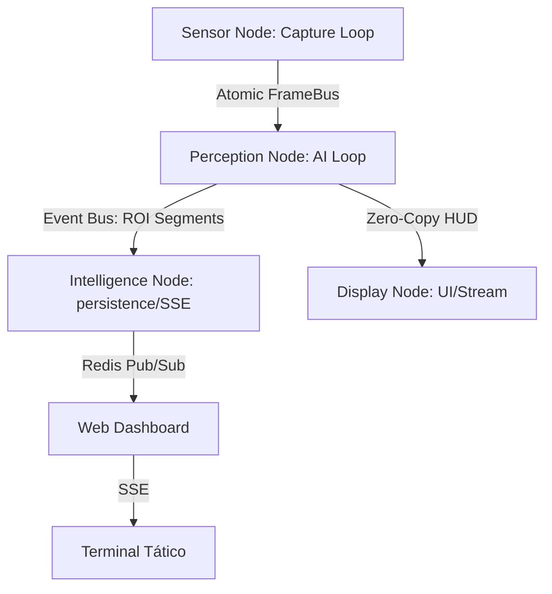

# 🔒 Olho de Deus — Distributed Real-Time Intelligence System

> Ecossistema de Inteligência Operacional para identificação biométrica em larga escala e análise forense de múltiplos fluxos de vídeo. Arquitetura orientada a eventos com processamento local (**Ghost Protocol**).

---

## 🏛️ Enterprise Architecture (Phase 32-Lab)

O sistema evoluiu de um script de monitoramento para uma ferramenta de inteligência industrial desacoplada em 4 camadas de execução:



### Principais Diferenciais de Engenharia:
- **Micro-Clock Architecture**: Loops independentes por thread (Capture, AI, Event, UI) eliminando o "blocking-drift" no processamento.
- **Double-Buffer FrameBus**: Mecanismo de swap de ponteiros `front/back` com lock infinitesimal, mitigando *cache line bouncing* no Ryzen 7.
- **Memory ROI Optimization**: Redução de 75x no tráfego de memória interna ao processar apenas recortes de face (~20KB) em vez de frames Full-HD (~1.5MB).
- **Thread Storm Prevention**: Contenção determinística de bibliotecas matemáticas (OMP/MKL) para estabilidade do scheduler Linux.

---

## 👁️ Módulo: Vision Engine (`olho_de_deus/`)

Motor de percepção neural ultra-otimizado para hardware restrito (15W TDP).

| Tecnologia | Implementação | Benefício |
|---|---|---|
| **YOLOv8** | ONNX/OpenVINO Otimizado | Detecção de alvos em tempo real |
| **ArcFace** | Hybrid 512-d Embedding | Identidade biométrica única |
| **Double-Buffering** | Atomic Pointer Swap | Latência física próxima de zero |
| **VA-API/Vega** | Hardware Acceleration | Decode de vídeo em iGPU, liberando CPU |
| **Drift-Free Clock** | `perf_counter` Sync | Eliminação de jitter visual em 30 FPS |

### 🛠️ Comandos de Elite (CLI)

```bash
cd olho_de_deus

# Iniciar Pipeline Lab-Tuned (Alta Performance)
poetry run python live_pipeline.py --id CAMERA_ID --profile

# Ativar Modo WebRTC + SSE API Server
poetry run python api_server.py  # Porta 8000
```

---

## 🌐 Módulo: Tactical Dashboard (`monitoring.html`)

Interface visual premium para centros de comando (SOC/C3) focada em telemetria de campo.

- **Stack**: Vanilla JS / CSS Glassmorphism / SSE (Server-Sent Events).
- **SSE Engine**: Consumo binário via Redis Pub/Sub para latência ponta-a-ponta < 150ms.
- **Micro-interações**: Feedback visual tático para detecções em tempo real com auto-expurgo de feed (buffer circular de DOM).

---

## 📊 Módulo: Intelligence Storage (`intelligence/`)

Camada de persistência criptografada e busca vetorial de alta densidade.

- **Storage**: SQLite 3 (WAL Mode) / PostgreSQL + `pgvector`.
- **Hardening**: Dossiês PDF protegidos por **AES-256 EAX** (CLE v1).
- **Search**: Indexador FAISS para busca facial em milissegundos sobre >15k registros.

---

## 📋 Changelog (Senior Roadmap)

| Versão | Fase | Milestone Técnico |
|---|---|---|
| **v32.2-Lab** | **Lab-Tuning** | Double-Buffering, Contenção de MKL/OMP, HW Accel (VA-API), Drift-Free Clock. |
| **v32.1-Ultra** | **Micro-Clocks** | Desacoplamento total de loops em 4 threads, RingBuffer e ROI memory optimization. |
| **v32.0** | **Web Scale** | Servidor FastAPI, SSE Dashboard, integração Redis Pub/Sub industrial. |
| **v31.x** | **Storage/Net** | Implementação da camada de Cache Redis, Fallback Graceful e WebRTC. |
| **v25.x** | **Hardening** | Protocolo de criptografia de dossiês (CLE v1) e Ghost Protocol. |

---

## 🚀 Quickstart (Production Mode)

1.  **Infra**: `docker compose up -d redis db go2rtc`
2.  **API**: `poetry run python api_server.py`
3.  **Vision**: `poetry run python live_pipeline.py --id [YOUTUBE_ID] --stream`

> [!IMPORTANT]
> **Ghost Protocol**: Este sistema opera em ambiente totalmente *air-gapped* ou local. Nenhum dado biométrico, vetor facial ou inteligência de campo deixa o hardware de execução sob nenhuma circunstância.
