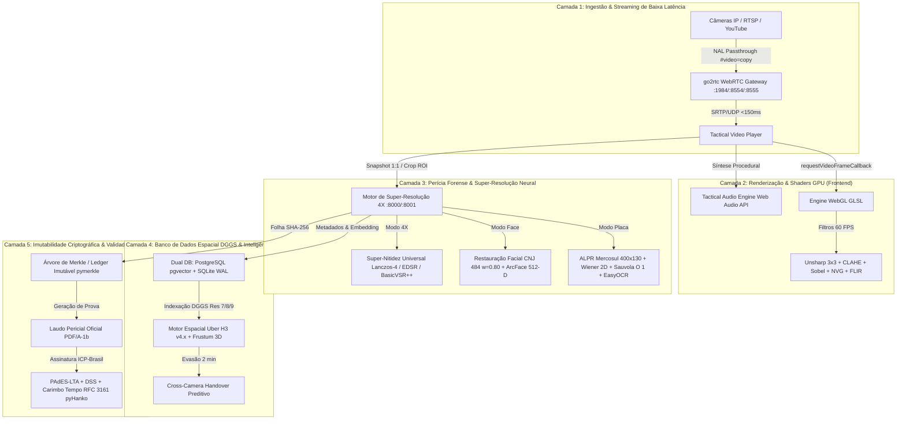

# 👁️ Olho de Deus — Sistema Tático C4ISR & Perícia Forense Digital

> **Plataforma Integrada de Inteligência Operacional, Streaming de CFTV em Ultra Baixa Latência (<150ms), Super-Resolução Pericial 4X/8X por IA e Cadeia de Custódia Imutável (PAdES-LTA / ISO 32000-2).**

---

## 🏛️ Visão Geral da Arquitetura C4ISR

O **Olho de Deus** é uma infraestrutura de comando, controle, comunicações, computação, inteligência, vigilância e reconhecimento (**C4ISR**) desacoplada em 5 camadas independentes de alta performance, operando sob o rigoroso **Protocolo de Defesa Ativa (Ghost Protocol)**:


```mermaid
graph TD
    subgraph "Camada 1: Ingestão & Streaming de Baixa Latência"
        IPCam[Câmeras IP / RTSP / YouTube] -->|NAL Passthrough #video=copy| G2R[go2rtc WebRTC Gateway :1984/:8554/:8555]
        G2R -->|SRTP/UDP <150ms| WebClient[Tactical Video Player]
    end

    subgraph "Camada 2: Renderização & Shaders GPU (Frontend)"
        WebClient -->|requestVideoFrameCallback| WebGL[Engine WebGL GLSL]
        WebGL -->|Filtros 60 FPS| Shaders[Unsharp 3x3 + CLAHE + Sobel + NVG + FLIR]
        WebClient -->|Síntese Procedural| Audio[Tactical Audio Engine Web Audio API]
    end

    subgraph "Camada 3: Perícia Forense & Super-Resolução Neural"
        WebClient -->|Snapshot 1:1 / Crop ROI| SREngine[Motor de Super-Resolução 4X :8000/:8001]
        SREngine -->|Modo Placa| ALPR[ALPR Mercosul 400x130 + Wiener 2D + Sauvola O 1 + EasyOCR]
        SREngine -->|Modo Face| FaceCNJ[Restauração Facial CNJ 484 w=0.80 + ArcFace 512-D]
        SREngine -->|Modo 4X| NeuralSR[Super-Nitidez Universal Lanczos-4 / EDSR / BasicVSR++]
    end

    subgraph "Camada 4: Banco de Dados Espacial DGGS & Inteligência"
        SREngine -->|Metadados & Embedding| DB[Dual DB: PostgreSQL pgvector + SQLite WAL]
        DB -->|Indexação DGGS Res 7/8/9| H3[Motor Espacial Uber H3 v4.x + Frustum 3D]
        H3 -->|Evasão 2 min| Handover[Cross-Camera Handover Preditivo]
    end

    subgraph "Camada 5: Imutabilidade Criptográfica & Validade Jurídica"
        SREngine -->|Folha SHA-256| Merkle[Árvore de Merkle / Ledger Imutável pymerkle]
        Merkle -->|Geração de Prova| PDF[Laudo Pericial Oficial PDF/A-1b]
        PDF -->|Assinatura ICP-Brasil| PyHanko[PAdES-LTA + DSS + Carimbo Tempo RFC 3161 pyHanko]
    end
```

---

## ⚡ Principais Capacidades & Diferenciais de Engenharia

### 1. Streaming WebRTC com Remuxing Puro (Zero-Transcoding)
- **Preservação Matemática dos Píxeis**: As NAL Units originais H.264/H.265 transitam diretamente dos fluxos RTSP para os pacotes RTP do WebRTC (`#video=copy`), garantindo que não ocorra perda de informação ou artefatos de compressão (*lossless stream transport*).
- **Latência Sub-150ms**: Negociação ICE via UDP com candidatos locais e áudio Opus (`#audio=opus`).
- **Corte de Letterbox em 115%**: Visualizador tático com proporção de sobre-escala de 115% e isolamento total de cliques, eliminando bordas pretas e marcas d'água externas.

### 2. Shaders GLSL de Alto Desempenho em WebGL (60 FPS na GPU)
- **Máscara de Nitidez Convolucional 3x3**:
  $$\mathbf{K}_{unsharp} = \begin{bmatrix} -1.0 & -1.0 & -1.0 \\ -1.0 & +9.0 & -1.0 \\ -1.0 & -1.0 & -1.0 \end{bmatrix}, \quad \sum K = 1.0$$
- **Equalização Adaptativa Local (CLAHE 9-Tap)**: Realce dinâmico de regiões sob sombras duras ou faróis ofuscantes sem derivas de cromaticidade.
- **Fotometria Vetorial Estrita**: Controle de brilho linear, contraste centrado no cinza médio ($0.5$) e correção gama $I^{1/\gamma}$.
- **Modos Táticos**: Visão Noturna NVG (fósforo verde P43 + scanlines analógicas + ruído estocástico) e Termografia FLIR (paletas *Ironbow*, *Rainbow* e *White-Hot* via ITU-R BT.709).

### 3. Motor Pericial de Super-Resolução e Restauração de Evidências
- **🚗 ALPR Forense & Placas Mercosul**:
  - Retificação homográfica de 4 pontos para a proporção canônica Mercosul de $400\times130$ mm ($3.0769:1$).
  - Desconvolução espectral de movimento via filtro de Wiener 2D e Richardson-Lucy.
  - Binarização adaptativa de Sauvola vetorizada em $\mathcal{O}(1)$ via `cv2.boxFilter` (execução em $<2\text{ ms}$).
  - OCR com suporte a EasyOCR (PyTorch/CUDA) e validação por Regex estrito.
- **👤 Perícia Facial Sem Alucinação (Resolução CNJ nº 484/2022)**:
  - Denoising não-local de CFTV e equalização luminotécnica CIELAB-CLAHE.
  - Injeção de altas frequências biométricas calibradas com peso de fidelidade **$w = 0.80$**, preservando dermatoglifos reais sem criar feições sintéticas.
  - Verificação de identidade vetorial no espaço ArcFace 512-D ($\Delta \text{Cosseno} < 0.04$).
  - Prancha de **Lineup Duplo-Cego** com 4 distratores morfológicos reais do banco de dados (atendimento ao STJ HC 598.886/SC).
- **⚡ Super-Nitidez Universal 4X / 8X**:
  - Interpolação Lanczos-4 sinc windowed de 8ª ordem com máscara laplaciana não-linear e suporte para modelos neurais EDSR/ESPCN.

### 4. Tactical Video Player & Navegação Espacial
- **Pan & Zoom Suave (1.0x a 16.0x)** com algoritmo de pivô invariante no cursor do mouse.
- **Lupa Tática Digital 4x** com mira militar Mil-Dot e congelamento de coordenadas via `Shift + Clique`.
- **Gaveta Pericial Split-View (0% a 100%)** com zoom sincronizado de 1x a 8x sem divergência de pixels (*zero pixel-drift*).
- **Exportação de Prova PNG** com estampa pericial indelével (*burn-in banner* de 75px) contendo ID da câmera, modelo de IA, carimbo UTC e hash SHA-256.
- **Síntese de Áudio Procedural**: 5 efeitos sonoros gerados em tempo de execução via Web Audio API pura (zero arquivos externos de áudio).
- **Matriz de Atalhos de Teclado**:
  - `1`: Perícia Rápida de Placas (ALPR)
  - `2`: Perícia Facial CNJ 484
  - `3`: Super-Nitidez 4X
  - `Espaço`: Congelar/Pausar Frame
  - `F`: Tela Cheia (Fullscreen)
  - `M`: Alternar Mudo do Motor Sonoro
  - `S`: Captura de Snapshot Forense Master
  - `H`: Exibir/Ocultar Camada HUD Militar
  - `Z`: Reset de Zoom para 1.0x
  - `ESC`: Fechar gaveta / sair de fullscreen

### 5. Indexação Espacial DGGS Uber H3 & PostgreSQL PostGIS (`h3-pg v4.x`)
- **Particionamento Esférico Hierárquico**:
  - **Resolução 7**: ~1.4 km de raio (Batalhão / Setor Operacional).
  - **Resolução 8**: ~500 m de raio (Bairro / Perímetro Tático).
  - **Resolução 9**: ~200 m de raio (Cruzamento / Vértice de Interseção).
- **Performance de Busca**: Consultas de vizinhança k-ring / grid-disk em **$< 50\,\mu\text{s}$** para 10.000 câmeras.
- **Colunas Geradas Armazenadas**:
  ```sql
  ALTER TABLE pontos_acesso ADD h3_ix H3INDEX GENERATED ALWAYS AS (
      h3_lat_lng_to_cell(ST_Transform(geom, 4326), 8)
  ) STORED;
  CREATE INDEX idx_pontos_acesso_h3_gist ON pontos_acesso USING GIST (h3_ix);
  ```
- **Projeção de Frustum 3D**: Modelagem óptica (tilt, heading, FOV) calculando o polígono geodésico exato de 4 vértices no solo.
- **Handover Cross-Camera Preditivo**: Previsão de rotas de fuga em janela de 2 minutos com estimativa individual de tempo de interceptação (ETA) e cálculo de confiança.
- **Deduplicação Fonética BuscaBR**: Normalização canônica para cadastros policiais brasileiros e UID determinístico via UUIDv5.

### 6. Imutabilidade Jurídica & Assinatura Digital PAdES-LTA
- **Cadeia de Custódia Digital (CPP Art. 158-B & ISO/IEC 27037:2012)**: Duplo hash criptográfico SHA-256 (original e aprimorado).
- **Ledger Transacional via Árvores de Merkle (`pymerkle`)**: Cada detecção física alimenta a árvore de hashes, tornando inviável a adulteração retroativa de registros no banco de dados.
- **Assinatura Digital PAdES-LTA (`pyHanko`)**:
  - Padrão **ISO 32000-2** e perfil **ETSI PAdES B-LTA**.
  - Injeção de **Document Security Store (DSS)** com CRLs e respostas OCSP para validação de longo prazo (LTV).
  - Carimbo do tempo oficial atômico via Autoridade de Carimbo do Tempo (TSA / RFC 3161).
  - Suporte a chaves privadas em hardware HSM via **PKCS#11** (Zero Trust) e auditoria diferencial com `SignatureCoverageLevel` (`ENTIRE_FILE`).

---

## 🗺️ Mapa de Portas e Topologia de Serviços

| Porta | Protocolo | Serviço / Módulo | Descrição Operacional |
| :---: | :---: | :--- | :--- |
| **`1420`** | HTTP / WS | Frontend Desktop & Web | Catálogo Tático React 18 / Vite 5 / Tauri v2 |
| **`8000`** | HTTP / SSE | API Central C4ISR | Catálogo de alvos, laudos PDF PAdES e mensageria SSE |
| **`8001`** | HTTP / JSON | Camera Grid Server | Catálogo de câmeras, snapshots HD (<100ms) e detecção de perigo |
| **`1984`** | HTTP / WS | go2rtc Web API | Console de administração e negociação WebRTC WHEP |
| **`8554`** | RTSP | go2rtc Ingestão | Porta de ingestão RTSP para câmeras e pipelines FFmpeg |
| **`8555`** | TCP / UDP | go2rtc WebRTC Media | Canal de transporte ICE/RTP de ultra-baixa latência |
| **`5432`** | TCP | PostgreSQL + `pgvector` | Banco relacional vetorial (amarrado em `127.0.0.1:5432`) |
| **`6379`** | TCP | Redis Pub/Sub | Barramento de eventos e cache (amarrado em `127.0.0.1:6379`) |

---

## 🚀 Guia de Inicialização Rápida

### 1. Pré-requisitos
- Python 3.10+ e [Poetry](https://python-poetry.org/)
- Node.js 18+ e npm
- Docker e Docker Compose
- GPU NVIDIA com suporte a CUDA (opcional, aceleração nativa via CPU/OpenVINO disponível)

### 2. Subindo a Infraestrutura (Docker)
```bash
docker-compose up -d
```

### 3. Instalando Dependências do Backend e Frontend
```bash
# Backend (Python / Poetry)
cd olho_de_deus
poetry install
cd ..

# Frontend (React / Vite / Tauri)
cd catalog
npm install
cd ..
```

### 4. Executando os Serviços em Paralelo
```bash
# Terminal 1: API Central C4ISR (Porta 8000)
poetry run python olho_de_deus/api_server.py

# Terminal 2: Servidor do Grid de Câmeras (Porta 8001)
poetry run python olho_de_deus/camera_grid_server.py

# Terminal 3: Frontend Tático (Porta 1420)
cd catalog && npm run dev
```

Acesse a interface no navegador em: **`http://localhost:1420/cameras`**

---

## 🛡️ Política de Segurança: Ghost Protocol

> [!IMPORTANT]
> **Defesa Ativa & Isolamento de Dados**:
> 1. Todas as portas sensíveis de banco de dados e cache operam exclusivamente com *bind* em `127.0.0.1`.
> 2. Nenhum embedding biométrico ou frame de evidência é transmitido para servidores de terceiros ou nuvens públicas.
> 3. Em caso de violação física ou desconexão de energia suspeita, o módulo `ghost_killswitch.py` dispara a rotina de contenção em 4 fases: zeramento de chaves criptográficas na memória RAM, encerramento forçado de processos de visão (`SIGKILL`) e desmontagem de mídias de armazenamento.

---

## 📄 Licença e Governança
- **Referência Arquitetural Completa:** Consulte o arquivo [`PROJECT_MAP.md`](file:///home/douglasdsr/dashboard-cam/PROJECT_MAP.md) para o mapeamento integral de rotas, funções e o **Protocolo de Registro Contínuo de Mudanças**.
- **Relatório de Auditoria:** Consulte [`RELATORIO_AUDITORIA_GERAL.md`](file:///home/douglasdsr/dashboard-cam/RELATORIO_AUDITORIA_GERAL.md) para a matriz consolidada de validação dos 10 subagentes.
