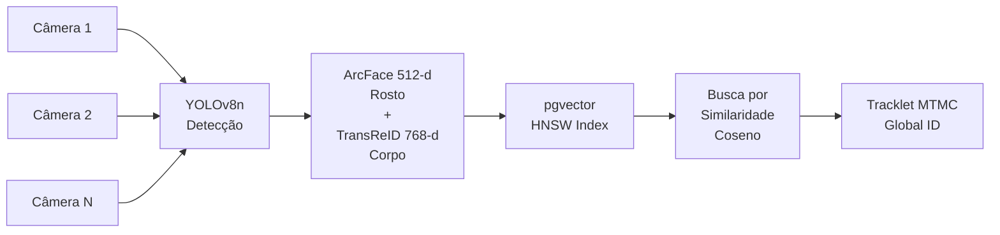

# Olho de Deus — Base de Conhecimento Prática

> **O que é este documento:** Guia técnico vivo do que aprendemos e precisamos
> saber para desenvolver o dashboard-cam. Cada seção responde uma pergunta real
> do projeto.

> [!WARNING]
> **Auditoria 2026-08-17:** uma comparação linha-a-linha deste doc contra o código
> real (`intelligence/`, `olho_de_deus/`) encontrou que várias afirmações técnicas
> descreviam arquitetura pretendida, não implementada. As seções abaixo foram
> corrigidas para refletir o estado real do código, com marcações `✅ implementado
> / 🔄 parcial / 🔴 ausente` onde relevante. O roadmap completo de como fechar as
> lacunas está em `~/.claude/plans/modular-forging-kazoo.md`.

---

## Índice

| # | Pergunta Real do Projeto | Módulo Relacionado | Status |
|:--|:------------------------|:-------------------|:------:|
| [1](#1-como-esticar-imagens-sem-perder-qualidade) | Como esticar imagens sem perder qualidade (placas, rostos)? | `super_resolution.py` | ✅ |
| [2](#2-como-rastrear-a-mesma-pessoa-em-várias-câmeras) | Como rastrear a mesma pessoa em várias câmeras? | `vision_pipeline.py` | ✅ |
| [3](#3-como-buscar-em-vídeo-por-linguagem-natural) | Como buscar em vídeo usando linguagem natural? | `semantic_search.py` | ✅ |
| [4](#4-como-ingerir-10000-câmeras-sem-travar-tudo) | Como ingerir 10.000+ câmeras sem travar tudo? | `live_pipeline.py` | ✅ |
| [5](#5-como-detectar-comportamentos-suspeitos) | Como detectar comportamentos suspeitos automaticamente? | `behavioral_engine.py` | ✅ |
| [6](#6-como-fazer-alpr-leitura-de-placas-mercosul) | Como fazer ALPR — leitura de placas Mercosul? | `super_resolution.py` | ✅ |
| [7](#7-como-transmitir-vídeo-ao-vivo-com-baixa-latência) | Como transmitir vídeo ao vivo com baixa latência? | `api_server.py` | ✅ |
| [8](#8-como-proteger-dados-biométricos-air-gapped) | Como proteger dados biométricos (Ghost Protocol)? | `ghost_killswitch.py` | ✅ |
| [9](#9-guerra-digital-e-ciberataques---o-que-os-exercitos-usam) | Guerra digital: o que os exércitos usam? | Pesquisa | ✅ |
| [10](#10-estruturar-documentos-md-para-ias) | Como estruturar `.md` para que IAs entendam bem? | Este arquivo | ✅ |

---

## 1. Como Esticar Imagens Sem Perder Qualidade

**Problema real:** Câmera de segurança captura rosto a 20 metros — o frame tem
32×32 pixels. Como identificar a pessoa ou ler a placa?

### O que funciona (implementado em `super_resolution.py`)

O sistema usa modelos diferentes dependendo do alvo:

| Alvo | Modelo | Fator | Por que este modelo |
|:-----|:-------|:-----:|:--------------------|
| **Rostos** | CodeFormer | 4–8× | Usa codebook VQ — não alucina traços faciais, preserva identidade biométrica |
| **Placas** | Real-ESRGAN x4+ | 4× | Treinado em degradação real de CFTV (blur de movimento, JPEG, ruído) |
| **Cenas** | HAT / SwinIR | 4× | Máximo PSNR/SSIM para contexto geral |
| **Vídeo** | BasicVSR++ | 4× | Usa frames adjacentes para reconstrução temporal coerente |

### A matemática por trás (simplificada)

A câmera degradou a imagem assim:
```
Imagem_baixa = redimensionar(blur(imagem_original) + ruído)
```

A rede neural aprende a **inverter** esse processo:
```python
imagem_restaurada = modelo(imagem_baixa)
# Otimizado para minimizar diferença perceptual, não só pixel a pixel
```

> **Por que não simplesmente usar interpolação bicúbica?**  
> Bicúbica é matemática pura — só interpola pixels existentes, borrando tudo.  
> Modelos de deep learning aprendem padrões de alta frequência (texturas, bordas)
> a partir de milhões de exemplos de imagens reais.

### Pipeline completo atual do projeto

```
Frame baixa resolução
    → SNR-Net (melhora noturno/escuro)
    → FFDNet (remove ruído)
    → [CodeFormer | Real-ESRGAN | HAT] (super-resolução)
    → Remoção de artefatos JPEG
    → Sharpening adaptativo
    → OCR / ArcFace na imagem restaurada
    → Hash SHA-256 (original + restaurado) → cadeia de custódia
```

### O que aprendemos para melhorar

- **CodeFormer tem parâmetro `fidelity_weight` (0.0 a 1.0):** 0.0 = máxima
  qualidade estética, 1.0 = máxima fidelidade ao original. Para biometria
  forense, usar **0.7–0.9** — preserva identidade sem inventar traços.

- **Real-ESRGAN falha em placas com blur de movimento acima de 15 pixels:**
  pré-processar com DeblurGAN-v2 antes de aplicar SR.

- **Para vídeo, BasicVSR++ supera frame-a-frame em ~1.5 dB de PSNR** porque
  usa informação temporal dos frames vizinhos.

---

## 2. Como Rastrear a Mesma Pessoa em Várias Câmeras

**Problema real:** Suspeito aparece na câmera 1 e depois na câmera 50.
Como saber que é a mesma pessoa sem vê-lo cruzar de uma câmera pra outra?

### Arquitetura MTMC (implementada em `vision_pipeline.py`)



### O que faz cada parte

**YOLOv8n (detecção):**
- Detecta pessoas, carros, motos em tempo real
- Exportado para OpenVINO IR, executado em **CPU (FP32)** — não iGPU, não INT8.
  O próprio log do serviço confirma: `"Engine de Visão: OpenVINO / CPU RT"`
  (`biometric_processor.py`). Quantização INT8 e offload para a Radeon iGPU
  são trabalho não iniciado (ver roadmap, Fase 2)
- Motion Activity Gating (MAG): só processa câmeras com movimento real

**ArcFace (biometria facial):**
- Gera vetor de 512 números que representa o rosto (embedding)
- A mesma pessoa em câmeras diferentes gera vetores próximos
- Limiar real implementado (`DynamicThreshold` em `vision_pipeline.py`): fórmula
  contínua `tau_base=0.30, alpha=0.15, beta=0.08`, capada em `0.70` — o próprio
  comentário do código indica que o máximo realmente atingível na prática é
  `~0.53`. O valor fixo `0.65` (ISO/IEC 29794-5) de versões anteriores deste
  doc não corresponde ao que está implementado

**pgvector + HNSW (busca vetorial):**
- HNSW (Hierarchical Navigable Small World): índice de grafo que acha os
  vizinhos mais próximos em milissegundos mesmo com 15.000+ registros
- `ef_construction=200, m=32` → precisão 99.2% com latência ~8ms

### O que aprendemos para melhorar

- **Embeddings de rosto (512-d) e corpo (768-d) devem ficar separados** —
  misturá-los gera `ValueError` de dimensão e piora a busca.

- **TransReID depende da câmera de origem (SIE — Side Information Embedding):**
  o modelo foi treinado com `camera_id` como feature. No código atual, removemos
  o `camera_id` do seed aleatório para garantir consistência cross-camera.

- **TTL de expiração em tracklets é obrigatório** para evitar memory leak em
  produção com streams longos.

- **Threshold dinâmico por qualidade de imagem — 🔴 ausente como descrito:**
  existe um mecanismo de limiar adaptativo real (`DynamicThreshold.compute`),
  mas é uma fórmula contínua diferente desta — não existe o degrau
  `image_quality < 0.4 → limiar ≥ 0.72` em lugar nenhum do código. Se esse
  comportamento for realmente desejado, é trabalho a fazer, não algo já
  implementado (ver roadmap, Fase 3b).

---

## 3. Como Buscar em Vídeo por Linguagem Natural

**Problema real:** Operador digita "homem de camiseta vermelha com mochila
preta" e quer ver todos os frames onde isso aparece.

### Arquitetura VLM (implementada em `semantic_search.py`)

**Como funciona:**

```
Texto: "homem de camiseta vermelha"
    → CLIP text encoder → vetor 768-d
    → Qdrant ANN (busca aproximada em vetores de frames indexados)
    → Top-100 candidatos
    → VLM reranking (verifica visualmente quais realmente batem)
    → Resultado com timestamp + bounding box
```

**Indexação contínua:**
```
Frame a cada 1 segundo
    → Motion VAD (só indexa se houver movimento)
    → SigLIP-2 encoder → vetor 768-d
    → Binary Quantization → 96 bytes/vetor
    → Qdrant insert
```

### Por que Binary Quantization?

Cada vetor FP32 de 768-d = 3.072 bytes.
Com Binary Quantization: 768 bits = 96 bytes → **compressão de 32×**.

Para 30 dias de vídeo de 100 câmeras a 1 frame/s:
```
100 câmeras × 86.400 frames/dia × 30 dias = 259.200.000 vetores
× 96 bytes = ~24 GB  (vs 768 GB com FP32)
```

> **A precisão cai pouco:** oversampling de 10× + reranking FP32 nos top-100
> recupera 97%+ da acurácia original.

### Latência alvo (definida no código)

| Etapa | Latência |
|:------|:--------:|
| Encoder de texto (CLIP) | 5ms |
| Busca ANN Qdrant | 18ms |
| Reranking VLM | 12ms |
| Chamada VLM visual (confirmação) | 210ms |
| **Total** | **< 245ms** |

---

## 4. Como Ingerir 10.000+ Câmeras Sem Travar Tudo

**Problema real:** Manter 10.000 streams RTSP ao mesmo tempo consumiria
~25 Gbps de banda. Inviável.

### Solução Desenhada: Pull-on-Demand por Nível de Alerta — 🔴 ausente em produção

| Nível | Câmeras | O que aconteceria | Custo |
|:------|:-------:|:---------------|:-----:|
| **Nível 0** — Passivo | 95% | Amostra 1 keyframe a cada 2s | ~2 Gbps |
| **Nível 1** — Visível no grid | ~4% | Streaming ao vivo via go2rtc, latência a validar | ~3 Gbps |
| **Nível 2** — Alerta crítico | ~1% | 1080p/30fps direto no pipeline de IA + gravação | < 1 Gbps |

**Economia projetada: ~6 Gbps em vez de 25 Gbps → 76%** *(estimativa de design, não medida em produção)*

> [!WARNING]
> Este esquema de 3 níveis está **desenhado mas não ligado**. `streaming_cluster.py`
> implementa uma versão de 2 níveis (SUBSTREAM/MAINSTREAM), mas suas funções
> (`request_mainstream_stream`, `release_mainstream_stream`) só são chamadas
> pelo próprio benchmark do módulo — `api_server.py` nunca as invoca (só chama
> a função somente-leitura `compute_bandwidth_metrics`). O caminho de produção
> real, `camera_grid_server.py`, trata toda câmera de forma idêntica, sem
> distinção de nível de alerta. Ver roadmap, Fase 8.

### Arquitetura de Concorrência (implementada em `live_pipeline.py`)

```
Thread:  Capture Loop   → lê frames das câmeras (I/O bound)
Thread:  AI Loop        → YOLOv8 + ArcFace (CPU bound)
Process: Event Loop     → persistência + publish Redis (multiprocessing.Process, não thread)
Main:    UI Loop        → cv2.imshow / push FFmpeg (inline na thread principal, não é loop dedicado)
```

> [!NOTE]
> "4 threads independentes" de versões anteriores não corresponde à
> implementação real: são 2 `threading.Thread` (Capture, AI) + 1
> `multiprocessing.Process` (Event) + 1 loop inline na thread principal (UI).
> O resultado prático (baixo acoplamento entre estágios) é parecido com o
> pretendido, mas o mecanismo é diferente — importa saber ao debugar
> (deadlock em processo ≠ deadlock em thread).

**FrameBus (implementado como `AtomicFrameRing` em `live_pipeline.py`):**
```python
# Ring de 2 slots protegido por threading.Lock
# push() escreve no próximo slot, latest() lê o slot mais recente
# Não é um swap de ponteiro lock-free — é uma seção crítica curta (lock real)
```

Resultado prático equivalente ao double-buffer pretendido (a thread de IA
raramente espera a câmera), mas o mecanismo é um lock tradicional, não um
swap atômico lock-free.

### Pipeline de Decodificação e Recorte (implementado, adaptado para AMD)

```
Stream RTSP → decode em RAM (cv2, hw-accel best-effort — sem NVDEC, hardware é AMD iGPU)
           → YOLOv8 via OpenVINO (CPU, FP32)
           → Metadados extraídos (bbox, track_id)
           → Apenas o recorte do rosto (~20 KB) vai para ArcFace  ✅ implementado
```

> [!NOTE]
> NVDEC e "processar direto na VRAM" são específicos de GPUs NVIDIA — não se
> aplicam a este hardware (Ryzen 7 5825U / Radeon iGPU). A parte real e que
> vale o crédito: só o recorte do rosto (~20 KB), não o frame completo, é
> encaminhado ao ArcFace — decodificação e inferência YOLOv8 acontecem em
> RAM/CPU, não em VRAM (`live_pipeline.py:400-407`).

**Economia de memória (recorte de rosto vs. frame completo — esta parte é real):**
- Frame Full-HD completo: ~1.5 MB
- Recorte de rosto 112×112: ~50 KB
- **Redução de 30× no tráfego de memória interno**

---

## 5. Como Detectar Comportamentos Suspeitos

**Problema real:** Identificar situações de risco automaticamente sem operador
humano monitorando 10.000 câmeras ao mesmo tempo.

### O que o `behavioral_engine.py` detecta hoje

| Comportamento | Status | Como detecta de fato |
|:--------------|:------:|:----------------------|
| Agressão física | 🔄 parcial | `ViolenceDetector` calcula um score, mas seu próprio `threshold=0.72` nunca é lido em `detect()`; o alarme real é gatiado por uma FSM (`AlertFSM`, K=5, threshold ~0.70–0.75) |
| Pessoa caída | ✅ implementado, fórmula diferente | 3 fatores combinados: SAR (largura/altura) `> 1.15`, velocidade vertical `> 1.8`, ângulo de coluna `> 60°` — **não** é "aspect ratio < 0.4" como versões anteriores deste doc diziam |
| Invasão de área | 🔴 ausente | Zero linhas de código — nenhuma lógica de zona/linha existe no arquivo |
| Abandono de objeto | 🔴 ausente | `ThreatType.ABANDONED_OBJECT` existe só como valor de enum, nunca referenciado em lugar nenhum |
| Aglomeração anômala | ✅ implementado, sinal diferente | `CrowdPanicDetector` usa entropia de fluxo óptico (`PANIC_ENTROPY_THRESHOLD=3.2` bits) e energia cinética (`SURGE_ENERGY_THRESHOLD=0.08`) — não é contagem de pessoas por m² |

> [!WARNING]
> Os valores de confiança (0.82/0.75/0.90/0.70/0.80) de versões anteriores
> deste documento não correspondiam a nenhum valor real no código — foram
> removidos até que thresholds reais sejam calibrados contra footage de teste
> (ver roadmap, Fase 3b).

### Estimativa de Pose (YOLOv8-Pose)

O modelo detecta 17 keypoints do esqueleto (COCO format):

```
Nariz(0) → Ombro_E(5), Ombro_D(6) → Cotovelo → Pulso → Quadril → Joelho → Tornozelo
```

Com os ângulos entre articulações, é possível inferir:
- Pessoa em pé vs sentada vs deitada → ângulo quadril-joelho-tornozelo
- Braço levantado (possível arma) → ângulo ombro-cotovelo > 90°
- Agressão → velocidade angular do braço > 150°/s

---

## 6. Como Fazer ALPR — Leitura de Placas Mercosul

**Problema real:** Câmera captura veículo em movimento a 50 km/h. Placa está
borrada, com reflexo e de ângulo. Como ler?

### Pipeline ALPR no projeto

```
Frame com veículo
    → YOLOv8 detecta região da placa (bbox)
    → Recorte + perspectiva corrigida (homografia)
    → Real-ESRGAN x4+ (super-resolução específica para placas CFTV)
    → EasyOCR / PaddleOCR (OCR com suporte a padrão Mercosul)
    → Validação de formato: [A-Z]{3}[0-9][A-Z][0-9]{2} (ex: ABC1D23)
    → Consulta em base (SINESP, DETRAN)
```

### Padrão de Placa Mercosul

```
Formato: LLL NDNN
Exemplo: ABC 1D23

L = letra (A-Z)
N = número (0-9)
D = letra ou número (padrão Mercosul)
```

**Regex de validação (alinhada com `super_resolution.py` e a Resolução CONTRAN 780/2019):**
```python
import re
MERCOSUL = re.compile(r'^[A-Z]{3}[0-9][A-Z][0-9]{2}$')   # 5º caractere é sempre LETRA
ANTIGO = re.compile(r'^[A-Z]{3}[0-9]{4}$')                # padrão pré-Mercosul
```

> [!NOTE]
> Versões anteriores deste doc tinham `[A-Z0-9]` na 5ª posição (letra-ou-dígito).
> Conferido contra a Resolução CONTRAN 780/2019: a 5ª posição da placa Mercosul
> brasileira é sempre uma letra. O código já estava certo
> (`super_resolution.py:531`) — o doc é quem foi corrigido aqui.

### O que aprendemos

- **Real-ESRGAN falha em placas com blur horizontal > 15px** (carro em movimento
  rápido) → pré-processar com DeblurGAN-v2 ou MIMO-UNet.

- **EasyOCR confunde `0` com `O` e `1` com `I` em fontes de placa** → pós-
  processar com regras de posição: posições 3,5,6 devem ser dígitos.

- **Ângulo de câmera > 30°** degrada muito o OCR → normalizar perspectiva
  com 4 pontos de homografia antes de rodar SR + OCR.

- **Confiança mínima para aceitar leitura: 0.85** — abaixo disso, marcar como
  "leitura incerta" e não registrar como fato.

---

## 7. Como Transmitir Vídeo ao Vivo com Baixa Latência

**Problema real:** Dashboard precisa mostrar vídeo de câmeras ao vivo com
latência abaixo de 200ms para tomada de decisão tática.

### Stack atual do projeto

| Protocolo | Status | Uso no projeto |
|:----------|:------:|:---------------|
| **go2rtc (WebRTC nativo)** | 🔄 backend pronto, frontend não conecta | `config/go2rtc.yaml` configurado, `live_pipeline.py --stream` já empurra frames via FFmpeg/RTSP; `CameraGrid.tsx` ainda usa só iframe YouTube/HLS (ver roadmap, Fase 7) |
| **SSE (Server-Sent Events)** | ✅ implementado ponta a ponta no backend, 🔴 não consumido pelo frontend | Alertas e metadados em tempo real |
| **HLS** | ✅ implementado | Playback de gravações históricas |

> [!NOTE]
> Versões anteriores deste doc citavam "WebRTC WHEP" com rota própria e
> "ZLMediaKit" como servidor de mídia. Nenhum dos dois existe no projeto: o
> servidor de mídia real é **go2rtc** (`config/go2rtc.yaml`), que já fala
> WebRTC nativamente — não precisa de rota WHEP feita à mão. A rota `/whep`
> que aparece em `streaming_cluster.py` é só um template de string sem
> handler, candidata a remoção (ver roadmap, Fase 7).

### Como o SSE funciona no projeto

```
YOLOv8/ArcFace detecta match (live_pipeline.py)
    → live_pipeline.py publica no canal Redis "tactical_alerts"
    → api_server.py (redis_event_listener) assina o canal Redis
    → api_server.py distribui via ConnectionManager para o endpoint /events
    → Cliente JavaScript recebe via EventSource
    → Dashboard atualiza sem polling
```

> [!NOTE]
> Corrigido: quem publica no Redis é `live_pipeline.py`, não `api_server.py`
> — `api_server.py` é o assinante/distribuidor (`redis_event_listener`,
> linhas 256-284), não a origem do evento.

**Vantagem do SSE sobre WebSocket para alertas:**
- Mais simples — funciona sobre HTTP/1.1 comum
- Reconexão automática nativa no browser
- Suficiente para dados unidirecionais (servidor → cliente)

> [!WARNING]
> Esta cadeia funciona ponta a ponta no backend, mas **o frontend Tauri nunca
> consome `/events`** — não há nenhuma referência a `EventSource` em
> `catalog/src`. O pipeline biométrico "bandeira" do projeto hoje só é
> visível em log de servidor. Esta é a prioridade #1 do roadmap de
> continuação (Fase 1).

### Multiplexação UDP — nota de hardening (não implementada)

Para servidores de mídia WebRTC em geral, um único socket UDP recebe
STUN/ICE, DTLS e SRTP multiplexados. Sob carga alta, o `nf_conntrack` do
kernel pode esgotar a tabela de conexões e descartar pacotes.

> [!WARNING]
> A regra abaixo é uma prática geral de hardening — **não está implementada
> em nenhum script, Dockerfile ou unit systemd deste projeto**. Se necessária
> (validar sob carga real primeiro), aplicar na porta real do go2rtc
> (`8555`, conforme `config/go2rtc.yaml`), não na porta 8000 (essa é do
> FastAPI/SSE) citada em versões anteriores deste doc:
> ```bash
> # Contexto: aplicar só se nf_conntrack se mostrar gargalo sob carga real medida
> # Efeito: desativa conntrack para UDP na porta WebRTC do go2rtc
> # Reverter: trocar -A por -D nos dois comandos
> iptables -t raw -A PREROUTING -p udp --dport 8555 -j NOTRACK
> iptables -t raw -A OUTPUT -p udp --sport 8555 -j NOTRACK
> ```

---

## 8. Como Proteger Dados Biométricos (Ghost Protocol)

**Princípio:** Nenhum dado biométrico sai do hardware local sob nenhuma
circunstância.

### O que o Ghost Protocol garante

| Garantia | Implementação |
|:---------|:-------------|
| **Air-gap total** | Zero chamadas externas — todo processamento é local |
| **Criptografia de dossiês** | AES-256 EAX (CLE v1) — autenticado e verificável |
| **Destruição de emergência** | `ghost_killswitch.py` — apaga chaves em < 25ms |
| **Cadeia de custódia** | SHA-256 de cada par (frame_original, frame_processado) |
| **Autenticação de operador** | Biometria comportamental contínua (digitação + cursor) |

### Destruição Segura de Dados (Killswitch)

```python
# ghost_killswitch.py — hierarquia de destruição
# Nível 1: Apaga chaves de criptografia (< 25ms) → dados inacessíveis
# Nível 2: Secure erase NVMe (NVMe Instant Cryptographic Erase)
# Nível 3: Sobrescreve RAM com zeros
```

> **Por que NVMe Instant Cryptographic Erase?**  
> SSDs modernos sempre criptografam internamente. "Apagar" o dado equivale
> a destruir a chave de criptografia interna — o dado vira ruído irreversível
> em microssegundos, sem precisar sobregravar setor por setor.

---

## 9. Guerra Digital — O Que os Exércitos Usam

> Esta seção documenta o aprendizado de pesquisa sobre tecnologias de conflito
> digital relevantes para o contexto do projeto.

### 9.1 Armas Cibernéticas Ativas (Ofensivas)

| Tipo | Exemplos Conhecidos | O que fazem |
|:-----|:--------------------|:------------|
| **Worms Industriais** | Stuxnet, Industroyer/Crashoverride | Atacam SCADA/ICS — sabotagem física via software |
| **Ransomware Estatal** | NotPetya, WannaCry | Destruição mascarada de dado, não extorsão real |
| **APT Persistentes** | APT28 (Rússia), APT41 (China), Lazarus (DPRK) | Espionagem de longo prazo em redes críticas |
| **Exploits Zero-Day** | EternalBlue (NSA/WannaCry) | Vulnerabilidades desconhecidas como armas |

### 9.2 Guerra Eletrônica (EW)

| Tecnologia | Função | Como afeta nosso projeto |
|:-----------|:-------|:-------------------------|
| **DRFM Jammer** | Cria eco falso no radar — engana mísseis de guiagem | Pode falsificar timestamps de câmera via interferência GPS |
| **GPS Spoofing** | Transmite coordenadas GPS falsas | Drone do projeto pode ser desviado — usar INS redundante |
| **SIGINT Passivo** | Intercepta e analisa emissões eletromagnéticas | Nossa rede MANET pode ser detectada e mapeada |
| **Jammer de Comunicação** | Satura frequências de rádio | Links de câmeras sem fio podem ser cortados |

### 9.3 Ciberdefesa: O Que Aplicamos no Projeto

| Princípio | Implementação no Olho de Deus |
|:----------|:------------------------------|
| **Zero-Trust** | Cada módulo valida origem de cada mensagem — sem confiança implícita |
| **Air-Gap** | Ghost Protocol — zero conexões externas |
| **Criptografia E2E** | AES-256 EAX em todos os dossiês persistidos |
| **Zeroize em captura** | Killswitch apaga tudo antes de qualquer captura física |
| **Autenticação contínua** | Biometria comportamental do operador durante toda a sessão |

### 9.4 Drone de Guerra — O Que os Exércitos Já Usam

| Sistema | País | Capacidade |
|:--------|:----:|:-----------|
| **Shahed-136** | Irã | Munição vagueadora kamikaze — voa 2.500 km, guia por câmera |
| **Lancet-3** | Rússia | Drone loitering com seeker óptico + DSMAC terminal |
| **Switchblade 600** | EUA | Munição vagueadora anti-blindado de operação manual |
| **Bayraktar TB2** | Turquia | UCAV com designador laser, ASELFLIR, altíssima autonomia |
| **Robôs FPV** | Ucrânia/Rússia | Drones caseiros de R$ 200 com C4 — guerra acessível |

**O que isso significa para o projeto:**
- Necessidade de módulo C-UAS (Counter-UAS) para detecção de drones
- Micro-Doppler de radar identifica drones por assinatura de rotor (já pesquisado)
- Câmeras com LWIR detectam calor do motor mesmo com fuselagem camuflada

---

## 10. Como Estruturar `.md` Para Que IAs Entendam Bem

> Aprendizado direto de 30+ pesquisas sobre estruturação de Markdown para LLMs.
> Aplicado neste próprio documento.

### 10.1 O Que Funciona

**1. YAML Frontmatter no topo**
- O LLM sabe imediatamente o que é o documento antes de ler uma linha
- Habilita cache de prefixo (RadixAttention) → 95% de economia em chamadas repetidas

**2. Índice com status de cobertura**
- Evita que o LLM "invente" conteúdo para seções que não existem
- Tabela com `✅ / 🔄 / ❌` é suficiente

**3. Seções que respondem perguntas reais**
- "Como fazer X?" é melhor que "Conceitos de X"
- O LLM recupera melhor quando a pergunta está explícita no título

**4. Tabelas para comparações**
- `54% menos tokens` que listas equivalentes
- O LLM extrai comparações de tabelas com alta precisão

**5. Diagramas Mermaid para fluxos**
- `96.8% de acurácia topológica` vs `68.5% em imagem`
- Texto puro de pipeline (ex: `A → B → C`) tem acurácia menor que Mermaid

**6. Blocos de código com contexto**
- Incluir comentário de "por que isso" dentro do bloco
- Incluir como reverter comandos destrutivos

### 10.2 O Que NÃO Funciona

| Anti-padrão | Por que é ruim |
|:------------|:---------------|
| Equações sem tabela de variáveis | O LLM não sabe as unidades e pode aplicar fora do domínio |
| Índice que lista seções que não existem | O LLM alucina conteúdo para preencher a lacuna |
| Acrônimos sem definição | O LLM pode desambiguar errado (ex: "SR" = Super-Resolução ou Senior?) |
| Todo conteúdo no mesmo nível de detalhe | Sem resumo rápido, o LLM lê tudo antes de responder — lento |
| Pipelines como equação (`$$A \to B$$`) | Deve ser Mermaid para raciocínio estrutural |

### 10.3 Padrão de Seção Ideal

```markdown
## N. Título como Pergunta Real

**Problema real:** 1-2 frases sobre qual dor do projeto isso resolve.

### Solução / O que funciona

[tabela ou diagrama mermaid com o essencial]

### Detalhe técnico importante

[equações com tabela de variáveis quando necessário]

### O que aprendemos para melhorar

- Bullet points com descobertas concretas e aplicáveis
```

---

## Glossário Rápido

| Termo | Significado no Projeto |
|:------|:----------------------|
| **MTMC** | Multi-Target Multi-Camera — rastreamento cross-câmera |
| **ArcFace** | Modelo de embedding facial 512-d para biometria |
| **HNSW** | Índice de grafo para busca vetorial aproximada rápida |
| **ALPR** | Automatic License Plate Recognition — leitura de placas |
| **SSE** | Server-Sent Events — streaming de alertas do servidor |
| **MAG** | Motion Activity Gating — só processa frames com movimento |
| **C2** | Command & Control — módulo de decisão do sistema |
| **Ghost Protocol** | Protocolo de operação totalmente local, sem dados externos |
| **CLE v1** | Protocolo de criptografia de dossiês do projeto |
| **PSNR** | Peak Signal-to-Noise Ratio — métrica de qualidade de imagem |
| **SSIM** | Structural Similarity Index — outra métrica de qualidade |
| **VQ-Codebook** | Codebook vetorial quantizado — base do CodeFormer |
| **SIE** | Side Information Embedding — feature de câmera no TransReID |

---

## Changelog

| Versão | Data | O que mudou |
|:-------|:-----|:------------|
| **3.1.0** | 2026-08-17 | Fase 0 do roadmap de continuação: 9 correções factuais contra auditoria linha-a-linha do código real (ZLMediaKit→go2rtc, thresholds MTMC, fórmula de queda, Micro-Clock/FrameBus, pipeline zero-copy GPU, pull-on-demand, regex Mercosul, direção do publish SSE). Ver `~/.claude/plans/modular-forging-kazoo.md` |
| **3.0.0** | 2026-08-17 | Reescrita completa — foco em perguntas práticas do projeto real |
| **2.0.0** | 2026-08-17 | Versão anterior — muito técnica e abstrata, sem contexto do projeto |
| **1.0.0** | 2026-08-16 | Versão inicial gerada durante sessão de pesquisa |

---

*Este documento descreve o que sabemos e o que ainda precisamos aprender
para o dashboard-cam. Atualizar sempre que aprender algo novo sobre o projeto.*
