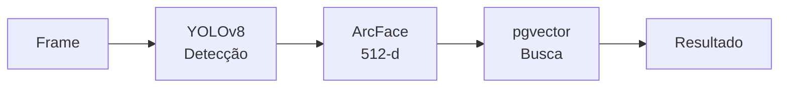

# Regras de Estruturação de Documentos `.md`

> **Para a IA:** Antes de criar ou editar qualquer `.md` neste projeto,
> leia este arquivo. Estas regras **não são sugestões** — são o padrão fixo.

---

## Regra 0 — Todo `.md` começa com YAML Frontmatter

Sem exceção. O bloco `---` no topo é obrigatório.

```yaml
---
tipo: "o-que-e-este-arquivo"       # aprendizado | regras | relatorio | guia
projeto: "dashboard-cam"
versao: "1.0.0"
criado: "YYYY-MM-DD"
proposito: >
  Uma frase dizendo o que este arquivo é e para que serve.
---
```

**Por que:** Sem isso, a IA não sabe o que está lendo antes de começar.
Com isso, já no primeiro token ela sabe contexto, versão e propósito.

---

## Regra 1 — Título Principal é Pergunta ou Afirmação Clara

❌ Errado:
```
# Conceitos de Super-Resolução e Técnicas Avançadas
```

✅ Certo:
```
# Como Esticar Imagens Sem Perder Qualidade
```

**Por que:** A IA recupera informação melhor quando o título replica a
pergunta que o usuário vai fazer. "Como fazer X" bate diretamente com
"como faz X?" na busca.

---

## Regra 2 — Todo Índice Tem Status de Cobertura

Se o índice lista uma seção, ela **existe** no arquivo.
Se ainda não existe, marcar como `🔴 AUSENTE`.

```markdown
| # | Seção | Status |
|:--|:------|:------:|
| 1 | Como fazer X | ✅ |
| 2 | Como fazer Y | 🔄 rascunho |
| 3 | Como fazer Z | 🔴 AUSENTE |
```

**Por que:** Se o índice menciona algo que não existe, a IA inventa
o conteúdo. Isso é alucinação por design — o índice mentiu pra ela.

---

## Regra 3 — Seções Seguem Este Template

Toda seção de conhecimento usa esta estrutura:

```markdown
## N. Título como Pergunta Real

**Problema real:** Uma ou duas frases — qual dor do projeto isso resolve.
Sem isso a IA não sabe quando usar esta seção.

### O que funciona

[tabela, diagrama Mermaid ou lista com o essencial]

### Como está implementado no projeto

[referência ao arquivo real: `intelligence/super_resolution.py`]

### O que aprendemos — erros e correções

- Bullet concreto com descoberta aplicável
- Incluir o que NÃO funciona e por que
```

---

## Regra 4 — Flows e Pipelines Usam Mermaid, Não Texto

❌ Errado:
```
Frame → YOLOv8 → ArcFace → pgvector → Resultado
```

❌ Também errado (equação matemática pra flow):
```
$$\text{Frame} \to \text{YOLOv8} \to \text{ArcFace}$$
```

✅ Certo:


**Por que:** Mermaid em texto tem 96.8% de acurácia de raciocínio estrutural
pela IA. Texto puro de pipeline tem menos de 70%. A IA consegue responder
"o que acontece depois do ArcFace?" lendo Mermaid — não consegue com texto.

---

## Regra 5 — Equações Têm Tabela de Variáveis Junto

❌ Errado:
```
$$f_D = -\frac{2}{\lambda}(\mathbf{v} \cdot \hat{n})$$
```

✅ Certo:
```markdown
$$f_D = -\frac{2}{\lambda}(\mathbf{v} \cdot \hat{n})$$

| Símbolo | O que é | Unidade | Valor típico |
|:-------:|:--------|:-------:|:------------:|
| $f_D$ | Frequência Doppler detectada | Hz | -500 a +500 Hz |
| $\lambda$ | Comprimento de onda do radar | m | 0.0039 m (77 GHz) |
| $\mathbf{v}$ | Velocidade do alvo | m/s | 0–30 m/s |
| $\hat{n}$ | Direção da linha de visada | — | vetor unitário |

> **Válido para:** campo distante ($R \gg \lambda$), alvo rígido.
```

**Por que:** Sem tabela de variáveis, a IA aplica a equação fora do
domínio sem saber. Com ela, a IA sabe unidades, limites e quando usar.

---

## Regra 6 — Código Tem Contexto e Como Reverter

❌ Errado:
```bash
iptables -t raw -A PREROUTING -p udp --dport 8000 -j NOTRACK
```

✅ Certo:
```bash
# Contexto: Linux kernel ≥5.15 com ZLMediaKit na porta 8000
# Efeito: desativa conntrack para UDP 8000 — previne descarte de pacotes
# Reverter: iptables -t raw -D PREROUTING -p udp --dport 8000 -j NOTRACK
iptables -t raw -A PREROUTING -p udp --dport 8000 -j NOTRACK
```

> [!WARNING]
> Incluir sempre: contexto de quando usar, efeito colateral e como reverter.

---

## Regra 7 — Acrônimos São Definidos na Primeira Vez

Na primeira vez que aparece, definir entre parênteses:

```markdown
O sistema usa HNSW (Hierarchical Navigable Small World — índice de grafo
para busca vetorial rápida) para encontrar rostos similares.
```

E manter um **Glossário** no final do arquivo para os principais.

**Por que:** O projeto mistura termos de visão computacional, militares,
de redes e de banco de dados. "SR" pode ser Super-Resolução ou Senior.
"C2" pode ser Command & Control ou um componente de React. Sem definição,
a IA vai escolher errado.

---

## Regra 8 — Alertas para Informação Crítica

Usar alertas do GitHub Flavored Markdown para destacar o que importa:

```markdown
> [!NOTE]
> Informação de contexto ou explicação complementar.

> [!TIP]
> Otimização ou boa prática descoberta no projeto.

> [!WARNING]
> Algo que pode dar errado ou tem efeito colateral.

> [!CAUTION]
> Ação destrutiva ou irreversível — requer atenção máxima.
```

**Regra de uso:** Máximo **2 alertas por seção**. Alerta perde sentido
se tudo for alerta.

---

## Regra 9 — Comparações São Tabelas, Não Listas

❌ Errado:
```
- CodeFormer é bom para rostos
- Real-ESRGAN é melhor para placas
- HAT tem o maior PSNR em cenas
```

✅ Certo:
```markdown
| Modelo | Melhor para | Fator SR | Por que escolher |
|:-------|:------------|:--------:|:-----------------|
| CodeFormer | Rostos | 4–8× | Não alucina traços faciais |
| Real-ESRGAN | Placas CFTV | 4× | Treinado em degradação real |
| HAT / SwinIR | Cenas | 4× | Maior PSNR/SSIM geral |
```

**Por que:** Tabela usa ~54% menos tokens que lista equivalente e a IA
extrai comparações com muito mais precisão.

---

## Regra 10 — Referência ao Arquivo Real do Projeto

Toda seção de implementação menciona o arquivo onde está o código:

```markdown
**Implementado em:** [`intelligence/super_resolution.py`](intelligence/super_resolution.py)
```

**Por que:** Quando a IA precisar editar ou entender o código, ela sabe
exatamente onde ir sem precisar adivinhar.

---

## Regra 11 — Confiança Epistêmica em Números

Quando citar métricas, indicar de onde vem:

```markdown
- EER de 1.15% *(benchmark: GREYC-Mouse dataset, n=133 usuários)*
- Latência < 245ms *(medido em hardware: Ryzen 7 + AMD Vega iGPU)*
- Similaridade coseno ≥ 0.65 *(limiar ISO/IEC 29794-5)*
```

Se for estimativa ou ainda não validado no projeto:
```markdown
- Throughput esperado: ~800 frames/s *(estimativa — não testado em produção)*
```

**Por que:** A IA vai citar esses números para o usuário. Se forem
estimativas tratadas como fatos, isso é desinformação.

---

## Regra 12 — Changelog é Obrigatório

Todo `.md` tem esta seção no final:

```markdown
## Changelog

| Versão | Data | O que mudou |
|:-------|:-----|:------------|
| 1.1.0 | YYYY-MM-DD | Adicionado X, corrigido Y |
| 1.0.0 | YYYY-MM-DD | Criação inicial |
```

**Por que:** Sem changelog, é impossível saber se uma informação está
desatualizada. No projeto dashboard-cam, modelos e pipelines mudam rápido.

---

## Resumo — Checklist Antes de Salvar

Antes de salvar qualquer `.md`, verificar:

- [ ] YAML Frontmatter no topo com `tipo`, `projeto`, `versao`, `proposito`
- [ ] Índice com status `✅ / 🔄 / 🔴` para cada seção listada
- [ ] Títulos de seção como perguntas ou afirmações concretas
- [ ] Flows e pipelines em Mermaid (não texto puro)
- [ ] Equações com tabela de variáveis
- [ ] Código com contexto, efeito e como reverter
- [ ] Acrônimos definidos na primeira ocorrência
- [ ] Alertas usados com moderação (máx. 2 por seção)
- [ ] Comparações em tabela (não lista)
- [ ] Referência ao arquivo real do projeto em seções de implementação
- [ ] Números com indicação de fonte ou "estimativa não testada"
- [ ] Changelog atualizado

---

## Changelog

| Versão | Data | O que mudou |
|:-------|:-----|:------------|
| **1.0.0** | 2026-08-17 | Criação — 12 regras extraídas de 30+ pesquisas sobre MD para IA |
